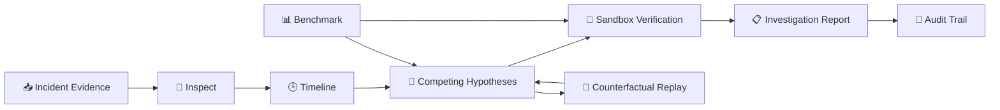

<div align="center">

# 🧠 OpsTwin
### Agentic Incident Investigation Platform

**Evidence-driven diagnosis • Hypothesis competition • Sandbox verification • Auditability**

<p>
  
  
  
  
</p>

<p>
  <a href="#-quick-start">Quick Start</a> •
  <a href="#-architecture">Architecture</a> •
  <a href="#-product-flow">Product Flow</a> •
  <a href="#-benchmark">Benchmark</a> •
  <a href="#-tech-stack">Tech Stack</a>
</p>

</div>

---

## ✨ What is OpsTwin?

**OpsTwin** is an agentic incident investigation platform built to reason about **simulated production incidents** using an evidence-first workflow.

Instead of jumping directly to a root cause, OpsTwin follows a structured investigation loop:

> **Inspect → Timeline → Compete → Verify → Report**

The platform can analyze incident evidence, rank competing root-cause hypotheses, challenge its own diagnosis with counter-evidence, verify conclusions in a sandbox, replay counterfactual scenarios, and preserve the full investigation trail.

> 🛡️ **Safety boundary:** OpsTwin is designed for simulation and evaluation. No production mutations are exposed.

---

## 🤖 Core Capabilities

| Capability | What it does |
|---|---|
| 🔎 **Evidence Explorer** | Inspects logs, signals, constraints and investigation evidence |
| 🕒 **Timeline Reconstruction** | Organizes incident events into a causal sequence |
| 🧠 **Hypothesis Competition** | Compares multiple root-cause candidates instead of assuming one answer |
| ⚔️ **Counter-Evidence** | Actively looks for evidence that could disprove a hypothesis |
| 🧪 **Sandbox Verification** | Tests conclusions in a deterministic, isolated environment |
| 🔁 **Counterfactual Replay** | Explores what could change under alternative conditions |
| 📊 **Benchmarking** | Measures baseline, advanced and adversarial performance |
| 🧾 **Audit Trail** | Preserves investigation steps for review and reproduction |

---

## 🧭 Product Flow

```text
                    ┌──────────────────────┐
                    │   📥 Incident Input   │
                    └──────────┬───────────┘
                               ↓
                    ┌──────────────────────┐
                    │   🔎 Inspect Evidence │
                    └──────────┬───────────┘
                               ↓
                    ┌──────────────────────┐
                    │   🕒 Build Timeline   │
                    └──────────┬───────────┘
                               ↓
                    ┌──────────────────────┐
                    │ 🧠 Compete Hypotheses │
                    └──────────┬───────────┘
                               ↓
                    ┌──────────────────────┐
                    │   🧪 Verify in        │
                    │      Sandbox          │
                    └──────────┬───────────┘
                               ↓
                    ┌──────────────────────┐
                    │   📋 Generate Report  │
                    └──────────┬───────────┘
                               ↓
                    ┌──────────────────────┐
                    │    🧾 Audit Trail     │
                    └──────────────────────┘

              ↺ Counterfactual Replay feeds back
                into hypothesis evaluation.
```

---

## 🖥️ Product Screens

### 01 · Overview — Incident Command Center

<p align="center">
  
</p>

The overview brings the complete investigation into one command-center experience, including incident analysis, accuracy metrics, safety posture, timeline, and competing hypotheses.

### 02 · Investigation — Evidence-First Diagnosis

<p align="center">
  
</p>

The investigation workspace focuses on supporting evidence, counter-evidence, hypothesis ranking, verification, and the final investigation report.

### 03 · Benchmark — Reproducible Evaluation

<p align="center">
  
</p>

The benchmark workspace compares OpsTwin against a fixed incident set and surfaces measurable evaluation results.

### 04 · Baseline vs Advanced

<p align="center">
  
</p>

This view highlights the impact of the advanced agentic workflow across diagnosis quality, evidence handling, verification, and adversarial evaluation.

### 05 · Audit Trail — Explainable Investigation History

<p align="center">
  
</p>

The audit layer captures evidence inspection, timeline reconstruction, hypothesis competition, verification, human checkpoints, and diagnosis comparisons.

---

## 📊 Benchmark

OpsTwin is evaluated across **10 fixed incidents** with baseline, advanced and adversarial measurements.

| Metric | Result |
|---|---:|
| Baseline accuracy | **80%** |
| Advanced accuracy | **100%** |
| Improvement | **+20 percentage points** |
| Adversarial evaluation | **100% — 5/5 passed** |
| Fixed incidents | **10** |

### Why the advanced workflow matters

The goal is not simply to produce an answer. The advanced workflow makes the reasoning process more disciplined by introducing **competing hypotheses, counter-evidence, sandbox verification and reproducible audit artifacts**.

---

## 🏗️ Architecture



---

## 🧩 Engineering Principles

### 🔍 Evidence over assumptions
Every diagnosis is grounded in available incident evidence and explicit constraints.

### 🧠 Competing explanations
The workflow keeps multiple hypotheses in play instead of immediately locking onto the first plausible root cause.

### 🧪 Verify before concluding
Sandbox experiments help validate whether the proposed explanation is consistent with the observed behavior.

### 🧾 Make the reasoning auditable
Investigation steps and artifacts are preserved so the path from evidence to conclusion can be inspected later.

### 🛡️ Safety by design
The experience clearly separates simulation from real production operations and avoids exposing production mutation capabilities.

---

## 🧰 Tech Stack

<p>
  
  
  
  
  
</p>

**Engineering areas:**

- Agentic investigation workflows
- Evidence analysis
- Root-cause hypothesis ranking
- Deterministic sandbox verification
- Counterfactual replay
- Benchmark & adversarial evaluation
- Audit / trajectory artifacts
- Automated testing
- CI with GitHub Actions

---

## 📂 Project Structure

```text
opstwin-agentic-workflows/
├── 🤖 agents/                 # Agentic investigation components
├── 📏 baseline/               # Baseline diagnosis workflow
├── 📊 evaluation/             # Benchmarks and evaluation logic
├── 🖥️ frontend/               # Web interface
├── 📁 data/incidents/         # Fixed incident scenarios
├── 🛠️ tools/                  # Supporting utilities
├── 🏆 submission/              # Challenge submission artifacts
├── 🖼️ assets/                 # Product screenshots and visuals
├── 🧪 tests/                  # Automated tests
├── 📦 requirements.txt        # Python dependencies
└── 📖 README.md
```

---

## 🚀 Quick Start

### 1. Clone

```bash
git clone https://github.com/nitindrathod4-alt/opstwin-agentic-workflows.git
cd opstwin-agentic-workflows
```

### 2. Install dependencies

```bash
python -m pip install -r requirements.txt
```

### 3. Run tests

```bash
pytest
```

### 4. Open the web application

```text
frontend/index.html
```

---

## 🏆 Built for micro1 Frontier Engineering Challenge 2026

OpsTwin was built for the **micro1 Frontier Engineering Challenge 2026** with a focus on reliable agentic engineering.

> **Reliable incident intelligence is not just about generating a diagnosis — it is about evidence, competing hypotheses, verification, reproducibility, safety, and auditability.**

---

## 👨‍💻 Author

<div align="center">

### Nitin Rathod
**DevOps / Cloud Engineer • AWS • Linux • Automation**

<a href="https://github.com/nitindrathod4-alt">
  
</a>

<br><br>

**🚀 Build • Investigate • Verify • Learn**

</div>
