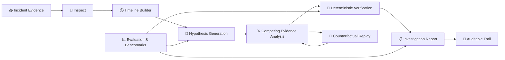

# 🧠 OpsTwin — Agentic Incident Investigation Platform

<p align="center">
  <strong>Evidence-driven incident diagnosis with an auditable reasoning trail.</strong>
</p>

<p align="center">
  <a href="https://github.com/nitindrathod4-alt/opstwin-agentic-workflows">
    
  </a>
  
  
  
</p>

<p align="center">
  
  
  
</p>

> **OpsTwin** is an agentic incident investigation platform built for simulated production incidents. It inspects evidence, reconstructs timelines, compares competing root-cause hypotheses, verifies conclusions in a deterministic sandbox, and preserves an auditable investigation trail.

<p align="center">
  <b>🔎 Inspect</b> &nbsp;→&nbsp;
  <b>🕒 Timeline</b> &nbsp;→&nbsp;
  <b>⚔️ Compete</b> &nbsp;→&nbsp;
  <b>🧪 Verify</b> &nbsp;→&nbsp;
  <b>📋 Report</b>
</p>

---

## 🎯 Why OpsTwin?

Traditional incident analysis can jump too quickly from a symptom to a suspected root cause.

OpsTwin takes an **evidence-first** approach:

- 🔎 **Inspect** incident evidence and constraints
- 🕒 **Reconstruct** events into a timeline
- ⚔️ **Compare** competing root-cause hypotheses
- 🧪 **Verify** conclusions using deterministic sandbox experiments
- 📋 **Report** evidence, uncertainty, and decisions
- 🧾 **Audit** the investigation trail for reproducibility

**Safety by design:** this project is a simulation-only environment. It does **not** expose production-changing actions.

---

## ✨ Key Capabilities

| Capability | Description |
|---|---|
| 🔍 Evidence-driven diagnosis | Analyze incident evidence before forming conclusions |
| 🧠 Competing hypotheses | Compare multiple possible root causes |
| ⚖️ Supporting vs counter-evidence | Explicitly weigh signals for and against each hypothesis |
| 🔁 Counterfactual replay | Re-evaluate incidents after removing selected evidence |
| 🧪 Deterministic verification | Validate conclusions in a controlled sandbox |
| 📊 Benchmark evaluation | Compare advanced workflow performance against a baseline |
| 🛡️ Adversarial testing | Test the investigation workflow against challenging cases |
| 🧾 Audit trail | Preserve reasoning, evidence, uncertainty, and decisions |
| 👤 Human checkpoint | Keep operational decisions behind a human review point |
| 🚫 Simulation-only safety | Production mutation remains disabled |

---

## 🏗️ Architecture



---

## 📈 Benchmark Snapshot

The current repository includes benchmark and adversarial evaluation artifacts from the hackathon submission.

| Metric | Result |
|---|---:|
| 🧪 Baseline accuracy | **80%** |
| 🚀 Advanced accuracy | **100%** |
| 📈 Improvement | **+20 percentage points** |
| 🛡️ Adversarial performance | **100%** |
| 📦 Fixed incidents | **10** |

> **Result:** The advanced investigation workflow achieved a **20 percentage-point improvement** over the baseline on the included benchmark.

---

## 📂 Project Structure

```text
opstwin-agentic-workflows/
│
├── 🤖 agents/                 # Agent definitions and investigation workflow logic
├── 📏 baseline/               # Baseline workflow for comparison
├── 📊 evaluation/             # Benchmark, scoring, and adversarial evaluation
├── 🖥️ frontend/               # Web interface / demonstration UI
├── 📁 data/                   # Incident datasets and supporting evidence
├── 🧪 tests/                  # Automated tests
├── 🛠️ tools/                  # Supporting investigation and verification tools
│
├── 🏆 submission/             # Hackathon evaluation and submission artifacts
│   ├── trajectories/          # Agent investigation traces
│   ├── benchmark_result.json
│   ├── adversarial_result.json
│   └── counterfactual_result.txt
│
├── 📦 requirements.txt        # Python dependencies
├── ⚙️ pytest.ini              # Pytest configuration
└── 📖 README.md               # Project documentation
```

---

## 🚀 Quick Start

### 1️⃣ Clone

```bash
git clone https://github.com/nitindrathod4-alt/opstwin-agentic-workflows.git
cd opstwin-agentic-workflows
```

### 2️⃣ Install dependencies

```bash
python -m pip install -r requirements.txt
```

### 3️⃣ Run tests

```bash
pytest
```

### 4️⃣ Run the web demonstration

Follow the application entry-point instructions inside:

```text
frontend/
```

---

## 🧪 Evaluation & Reproducibility

OpsTwin includes dedicated evaluation components for:

- 📊 Baseline vs advanced workflow comparison
- 🛡️ Adversarial incident evaluation
- 🔁 Counterfactual evidence-removal replay
- 🧾 Agent trajectory / reasoning-trace artifacts
- ✅ Automated test coverage

The `submission/` directory contains the evaluation outputs used for the hackathon submission.

---

## 🔐 Safety & Auditability

OpsTwin is intentionally designed as a **safe simulation environment**.

### Safety principles

- 🚫 No production-changing actions
- 🧪 Deterministic sandbox verification
- 🧾 Evidence and decisions recorded for auditability
- ⚠️ Uncertainty preserved rather than hidden
- 👤 Human checkpoint before operational decisions
- 🔁 Reproducible investigation workflow

This makes the project suitable for experimenting with **agentic incident investigation** without allowing an AI workflow to mutate a real production environment.

---

## 🏆 Hackathon

Built as a project for the **micro1 Frontier Engineering Challenge 2026**.

The repository includes the investigation implementation, evaluation logic, benchmark results, adversarial results, and submission traces used during the challenge.

---

## 💡 What I Learned

This project provided hands-on experience with:

- 🤖 Agentic workflow design
- 🔍 Evidence-based reasoning
- 🧠 Root-cause analysis
- 📊 Evaluation and benchmarking
- 🧪 Deterministic verification
- 🛡️ Safety and auditability for AI systems
- 🧰 Building reproducible engineering workflows

---

## 👨‍💻 Author

**Nitin Rathod**

🔗 GitHub: [@nitindrathod4-alt](https://github.com/nitindrathod4-alt)

---

<p align="center">
  <strong>🚀 Build. Investigate. Verify. Learn.</strong>
</p>

<p align="center">
  <sub>OpsTwin — Agentic Incident Investigation Platform</sub>
</p>
