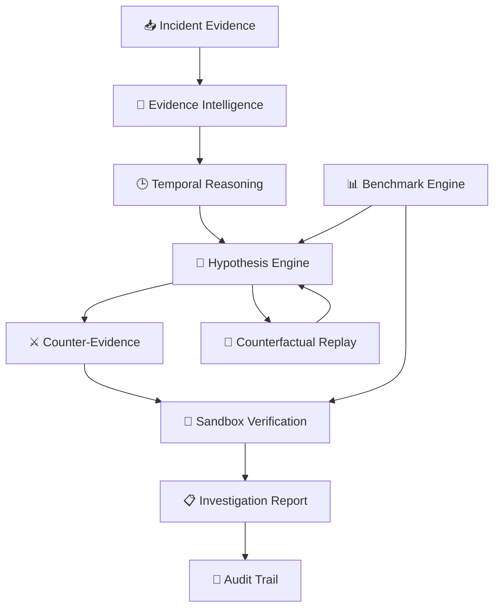

<div align="center">

# 🧠⚡ OpsTwin
### Next-Gen Agentic Incident Intelligence

**AI-powered investigation for complex incidents — evidence first, reasoning visible, verification before conclusion.**

<p>
  
  
  
  
</p>

<p>
  <b>🔎 Observe</b> → <b>🧠 Reason</b> → <b>⚔️ Challenge</b> → <b>🧪 Verify</b> → <b>📋 Explain</b>
</p>

</div>

---

## 🌌 The Idea

**OpsTwin** is a next-generation **agentic incident investigation platform** that turns raw incident evidence into an explainable, verifiable root-cause investigation.

Instead of asking an AI agent to simply **“find the problem”**, OpsTwin creates a structured reasoning loop:

> **Evidence → Timeline → Hypotheses → Counter-Evidence → Verification → Report**

The result is designed to be **explainable, reproducible, auditable and safety-first**.

> 🛡️ **Simulation boundary:** OpsTwin is intended for simulated incidents and evaluation. It does not expose production mutation capabilities.

---

## 🧠 AI Investigation Engine

| Intelligence Layer | Purpose |
|---|---|
| 🔎 **Evidence Intelligence** | Extract and inspect relevant incident signals |
| 🕒 **Temporal Reasoning** | Reconstruct what happened and when |
| 🧠 **Hypothesis Engine** | Generate and rank competing root causes |
| ⚔️ **Adversarial Challenge** | Search for counter-evidence against the leading hypothesis |
| 🧪 **Verification Engine** | Validate reasoning inside a deterministic sandbox |
| 🔁 **Counterfactual Replay** | Explore alternative conditions and outcomes |
| 📊 **Evaluation Engine** | Compare baseline, advanced and adversarial results |
| 🧾 **Audit Engine** | Preserve the complete investigation trajectory |

---

## ⚡ Agentic Workflow

```text
┌─────────────────────────────────────────────────────┐
│              📥 INCIDENT SIGNALS                    │
│       Logs • Events • Metrics • Constraints          │
└─────────────────────────┬───────────────────────────┘
                          ↓
┌─────────────────────────────────────────────────────┐
│ 🔎 OBSERVE                                           │
│ Collect and inspect evidence                         │
└─────────────────────────┬───────────────────────────┘
                          ↓
┌─────────────────────────────────────────────────────┐
│ 🕒 UNDERSTAND                                        │
│ Reconstruct the incident timeline                    │
└─────────────────────────┬───────────────────────────┘
                          ↓
┌─────────────────────────────────────────────────────┐
│ 🧠 REASON                                            │
│ Generate + rank competing hypotheses                │
└─────────────────────────┬───────────────────────────┘
                          ↓
┌─────────────────────────────────────────────────────┐
│ ⚔️ CHALLENGE                                         │
│ Search for counter-evidence                          │
└─────────────────────────┬───────────────────────────┘
                          ↓
┌─────────────────────────────────────────────────────┐
│ 🧪 VERIFY                                             │
│ Test the leading explanation in sandbox              │
└─────────────────────────┬───────────────────────────┘
                          ↓
┌─────────────────────────────────────────────────────┐
│ 📋 EXPLAIN                                            │
│ Produce reproducible diagnosis + audit trail         │
└─────────────────────────────────────────────────────┘
```

---

## 🚀 Why OpsTwin is Different

### Traditional troubleshooting
**Signal → Guess → Fix**

### OpsTwin approach
**Evidence → Timeline → Compete → Challenge → Verify → Explain**

This makes the investigation process more disciplined instead of relying on a single unverified AI answer.

---

## 🖥️ Product Experience

OpsTwin is organized around five investigation experiences:

| Experience | Focus |
|---|---|
| 🖥️ **Command Center** | Incident overview, status and investigation context |
| 🔍 **Investigation Workspace** | Evidence, counter-evidence and hypotheses |
| 📈 **Benchmark Lab** | Reproducible performance evaluation |
| ⚖️ **Baseline vs Advanced** | Measure the impact of agentic reasoning |
| 🧾 **Audit Trail** | Explainable investigation history |

### 🎨 AI-Native Design

The interface follows a futuristic **AI Operations** visual language:

**Deep dark UI · Electric purple · Cyan intelligence signals · Magenta highlights · High-contrast data panels**

---

## 📊 Evaluation Snapshot

| Metric | Result |
|---|---:|
| 🎯 Baseline accuracy | **80%** |
| 🧠 Advanced accuracy | **100%** |
| 📈 Improvement | **+20 percentage points** |
| 🛡️ Adversarial evaluation | **100% — 5/5 passed** |
| 🧪 Fixed incidents | **10** |

> The benchmark measures whether adding structured agentic investigation improves diagnosis quality.

---

## 🏗️ System Architecture



---

## 🧩 Engineering Principles

**🔍 Evidence over assumptions**  
Ground reasoning in observable incident evidence.

**🧠 Multiple hypotheses**  
Do not immediately commit to the first plausible explanation.

**⚔️ Challenge the diagnosis**  
Actively search for evidence that could prove the leading hypothesis wrong.

**🧪 Verify before concluding**  
Use sandbox experiments to test whether the explanation matches observed behavior.

**🧾 Preserve reasoning**  
Keep the investigation trajectory inspectable and reproducible.

**🛡️ Safety first**  
Separate simulated investigation from real production operations.

---

## 🧰 Technology

<p>
  
  
  
  
  
</p>

**Core engineering:** Agentic workflows • Incident analysis • Root-cause reasoning • Evidence ranking • Sandbox verification • Counterfactual replay • Benchmarking • Audit artifacts • Automated testing • CI/CD

---

## 📂 Project Structure

```text
opstwin-agentic-workflows/
│
├── 🤖 agents/                 # Agentic investigation logic
├── 📏 baseline/               # Baseline diagnosis workflow
├── 📊 evaluation/             # Benchmark + adversarial evaluation
├── 🖥️ frontend/               # AI-native web interface
├── 📁 data/incidents/         # Simulated incident scenarios
├── 🛠️ tools/                  # Supporting utilities
├── 🏆 submission/              # Challenge artifacts
├── 🖼️ assets/                 # Project visuals
├── 🧪 tests/                  # Automated tests
├── 📦 requirements.txt
└── 📖 README.md
```

---

## 🚀 Quick Start

### 01 · Clone

```bash
git clone https://github.com/nitindrathod4-alt/opstwin-agentic-workflows.git
cd opstwin-agentic-workflows
```

### 02 · Install

```bash
python -m pip install -r requirements.txt
```

### 03 · Test

```bash
pytest
```

### 04 · Launch

Open:

```text
frontend/index.html
```

---

## 🏆 micro1 Frontier Engineering Challenge 2026

Built for the **micro1 Frontier Engineering Challenge 2026** around a simple idea:

> **AI incident investigation should not stop at prediction. It should reason, challenge, verify and explain.**

---

## 👨‍💻 Builder

<div align="center">

### Nitin Rathod

**DevOps / Cloud Engineer**  
AWS • Linux • Automation • AI Engineering

<a href="https://github.com/nitindrathod4-alt">
  
</a>

<br><br>

**⚡ Build intelligent systems. Investigate deeply. Verify everything.**

</div>
