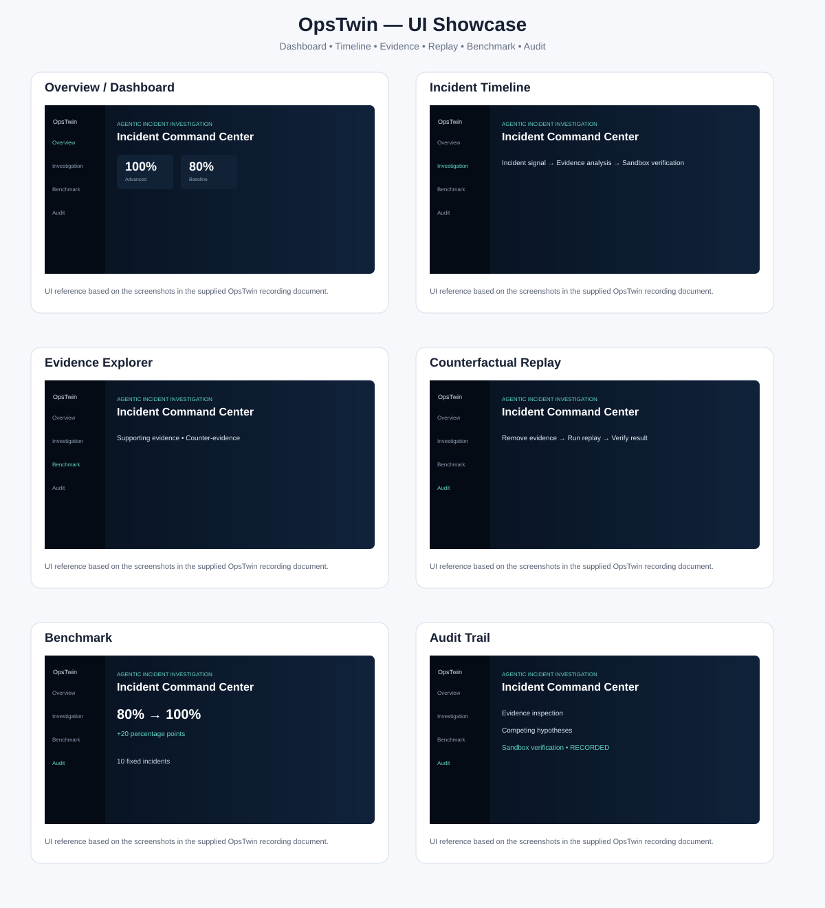
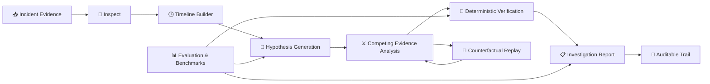

# 🧠 OpsTwin — Agentic Incident Investigation Platform

<p align="center"><strong>Evidence-driven incident diagnosis with an auditable reasoning trail.</strong></p>

<p align="center">


</p>

> OpsTwin is an agentic incident investigation platform for simulated production incidents. It inspects evidence, reconstructs timelines, compares competing root-cause hypotheses, verifies conclusions in a deterministic sandbox, and preserves an auditable investigation trail.

<p align="center"><b>🔎 Inspect → 🕒 Timeline → ⚔️ Compete → 🧪 Verify → 📋 Report</b></p>

---

## 🖥️ Product UI Showcase

<p align="center">
  
</p>

The showcase above is based on the UI screens in the supplied OpsTwin recording reference: Dashboard, Incident Timeline, Evidence Explorer, Counterfactual Replay, Benchmark, and Audit.

---

## 🎯 Why OpsTwin?

OpsTwin follows an **evidence-first** investigation model:

- 🔎 Inspect incident evidence and constraints
- 🕒 Reconstruct events into a timeline
- ⚔️ Compare competing root-cause hypotheses
- 🧪 Verify conclusions with deterministic sandbox experiments
- 📋 Report evidence, uncertainty, and decisions
- 🧾 Preserve an auditable investigation trail

**Safety by design:** simulation-only; no production-changing actions are exposed.

---

## ✨ Key Capabilities

| Capability | Description |
|---|---|
| 🔍 Evidence-driven diagnosis | Analyze incident evidence before conclusions |
| 🧠 Competing hypotheses | Compare multiple possible root causes |
| ⚖️ Supporting vs counter-evidence | Explicitly weigh evidence on both sides |
| 🔁 Counterfactual replay | Re-run investigation after removing evidence |
| 🧪 Deterministic verification | Validate conclusions in a controlled sandbox |
| 📊 Benchmark evaluation | Compare advanced workflow with baseline |
| 🛡️ Adversarial testing | Evaluate difficult incident cases |
| 🧾 Audit trail | Preserve evidence, reasoning and decisions |
| 👤 Human checkpoint | Keep operational decisions behind review |
| 🚫 Simulation-only safety | Production mutation remains disabled |

---

## 🏗️ Architecture



---

## 📈 Benchmark Results

| Metric | Result |
|---|---:|
| 🧪 Baseline accuracy | **80%** |
| 🚀 Advanced accuracy | **100%** |
| 📈 Improvement | **+20 percentage points** |
| 🛡️ Adversarial performance | **100%** |
| 📦 Fixed incidents | **10** |

The supplied recording reference also shows the benchmark page covering ten fixed incidents and baseline-vs-advanced cases. 

---

## 📂 Project Structure

```text
opstwin-agentic-workflows/
├── 🤖 agents/
├── 📏 baseline/
├── 📊 evaluation/
├── 🖥️ frontend/
├── 📁 data/
├── 🧪 tests/
├── 🛠️ tools/
├── 🏆 submission/
│   ├── trajectories/
│   ├── benchmark_result.json
│   ├── adversarial_result.json
│   └── counterfactual_result.txt
├── 📦 requirements.txt
├── ⚙️ pytest.ini
└── 📖 README.md
```

---

## 🚀 Quick Start

```bash
git clone https://github.com/nitindrathod4-alt/opstwin-agentic-workflows.git
cd opstwin-agentic-workflows
python -m pip install -r requirements.txt
pytest
```

For the web demonstration, follow the application entry-point instructions in `frontend/`.

---

## 🧪 Evaluation & Reproducibility

OpsTwin includes:

- Baseline vs advanced workflow evaluation
- Adversarial incident evaluation
- Counterfactual evidence-removal replay
- Agent trajectory / reasoning-trace artifacts
- Automated tests

---

## 🔐 Safety & Auditability

- 🚫 No production-changing actions
- 🧪 Deterministic sandbox verification
- 🧾 Evidence and decisions recorded
- ⚠️ Uncertainty preserved
- 👤 Human checkpoint before operational decisions
- 🔁 Reproducible investigation workflow

---

## 🏆 micro1 Frontier Engineering Challenge 2026

Built for the **micro1 Frontier Engineering Challenge 2026**.

The repository contains the investigation implementation, evaluation logic, benchmark results, adversarial results, and submission traces.

---

## 💡 What I Learned

🤖 Agentic workflow design • 🔍 Evidence-based reasoning • 🧠 Root-cause analysis • 📊 Evaluation • 🧪 Deterministic verification • 🛡️ AI safety & auditability

---

## 👨‍💻 Author

**Nitin Rathod**  
GitHub: [@nitindrathod4-alt](https://github.com/nitindrathod4-alt)

<p align="center"><strong>🚀 Build. Investigate. Verify. Learn.</strong></p>
