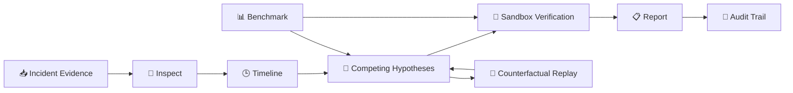

# 🧠 OpsTwin — Agentic Incident Investigation Platform

<p align="center"><strong>Evidence-driven incident diagnosis with an auditable reasoning trail.</strong></p>

<p align="center">


</p>

> **OpsTwin** is an agentic incident investigation platform for simulated production incidents. It analyzes evidence, ranks competing root-cause hypotheses, verifies conclusions in a sandbox, supports counterfactual replay, and preserves an auditable investigation trail.

<p align="center"><b>🔎 Inspect → 🕒 Timeline → ⚔️ Compete → 🧪 Verify → 📋 Report</b></p>

---

# 🖥️ Product UI — Main 5 Screens

> Each screen below represents a key stage of the actual OpsTwin frontend.

## 01 — 🖥️ Overview / Dashboard

<p align="center">
  
</p>

**What this page does**

The Overview is the main Incident Command Center. It brings the investigation into one place:

- 🔥 Live Incident Analyzer
- 📊 Advanced accuracy — **100%**
- 📊 Baseline accuracy — **80%**
- 🛡️ Adversarial result — **100%**
- 🔐 Sandbox safety posture
- 🕒 Incident timeline
- 🧠 Competing hypotheses

---

## 02 — 🔍 Investigation

<p align="center">
  
</p>

**What this page does**

The Investigation view is where the evidence-driven diagnosis happens:

- 🔎 Evidence Explorer
- ✅ Supporting evidence
- ⚠️ Counter-evidence
- 🧠 Competing root-cause hypotheses
- 🧪 Verification workflow
- 📋 Investigation report

The workflow is intentionally structured as:

**Inspect → Timeline → Compete → Verify → Report**

---

## 03 — 📈 Benchmark

<p align="center">
  
</p>

**What this page does**

The Benchmark view evaluates OpsTwin against **10 fixed incidents**.

| Metric | Result |
|---|---:|
| Baseline accuracy | **80%** |
| Advanced accuracy | **100%** |
| Improvement | **+20 percentage points** |
| Adversarial | **100% — 5/5 passed** |
| Fixed incidents | **10** |

---

## 04 — ⚖️ Baseline vs Advanced

<p align="center">
  
</p>

**What this page does**

This view makes the improvement from the baseline workflow to the advanced agentic workflow easy to evaluate.

The comparison focuses on:

- 🎯 Diagnosis accuracy
- 🔎 Evidence quality
- 🧠 Hypothesis ranking
- 🧪 Verification
- 🛡️ Adversarial performance
- 📊 Reproducible evaluation

The measured result is **80% baseline → 100% advanced**.

---

## 05 — 🧾 Audit Trail

<p align="center">
  
</p>

**What this page does**

The Audit view preserves the investigation history so the diagnosis can be inspected and reproduced.

It records:

- 🔎 Evidence inspection
- 🕒 Timeline
- 🧠 Competing hypotheses
- ⚠️ Counter-evidence
- 🧪 Sandbox verification
- 👤 Human checkpoint
- 📊 Baseline vs advanced diagnosis

This makes the workflow **auditable, reproducible, and safety-oriented**.

---

## 🎯 Why OpsTwin?

OpsTwin follows an **evidence-first** investigation model:

- 🔎 Inspect incident evidence and constraints
- 🕒 Reconstruct events into a timeline
- ⚔️ Compare competing root-cause hypotheses
- 🧪 Verify conclusions using sandbox experiments
- 🔁 Test diagnosis with counterfactual replay
- 📋 Generate a reproducible report
- 🧾 Preserve an auditable investigation trail

**Safety by design:** the frontend explicitly labels the environment **SAFE / SIMULATION ONLY** and states that no production mutations are exposed.

---

## 🏗️ Architecture



---

## 🧰 Tech & Engineering

- 🐍 Python
- 🌐 HTML5 / CSS3 / JavaScript
- 🤖 Agentic investigation workflow
- 🔎 Evidence analysis
- 🧠 Root-cause hypothesis ranking
- 🧪 Deterministic sandbox verification
- 🔁 Counterfactual replay
- 📊 Benchmark & adversarial evaluation
- 🧾 Audit / trajectory artifacts
- ✅ Automated tests
- ⚙️ GitHub Actions CI

---

## 📂 Project Structure

```text
opstwin-agentic-workflows/
├── 🤖 agents/
├── 📏 baseline/
├── 📊 evaluation/
├── 🖥️ frontend/
├── 📁 data/incidents/
├── 🛠️ tools/
├── 🏆 submission/
├── 🖼️ assets/
│   └── opstwin-5-panels.jpg
├── 🧪 tests/
├── 📦 requirements.txt
└── 📖 README.md
```

---

## 🚀 Quick Start

```bash
git clone https://github.com/nitindrathod4-alt/opstwin-agentic-workflows.git
cd opstwin-agentic-workflows
python -m pip install -r requirements.txt
pytest
```

### Web application

```text
frontend/index.html
```

---

## 🏆 micro1 Frontier Engineering Challenge 2026

Built for the **micro1 Frontier Engineering Challenge 2026**.

> Building reliable agentic systems is not only about generating a diagnosis — it is about **evidence, competing hypotheses, verification, reproducibility, safety, and auditability**.

---

## 👨‍💻 Author

**Nitin Rathod**

<p align="center"><strong>🚀 Build. Investigate. Verify. Learn.</strong></p>
