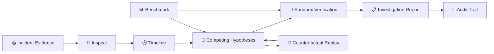

<div align="center">

# 🧠 OpsTwin
### Agentic Incident Investigation Platform

**Evidence-driven diagnosis • Hypothesis competition • Sandbox verification • Auditability**

<p>
  
  
  
  
</p>

<p>
  <a href="#-quick-start">Quick Start</a> •
  <a href="#-architecture">Architecture</a> •
  <a href="#-product-flow">Product Flow</a> •
  <a href="#-benchmark">Benchmark</a> •
  <a href="#-tech-stack">Tech Stack</a>
</p>

</div>

---

## ✨ What is OpsTwin?

**OpsTwin** is an agentic incident investigation platform built to reason about **simulated production incidents** using an evidence-first workflow.

Instead of jumping directly to a root cause, OpsTwin follows:

> **Inspect → Timeline → Compete → Verify → Report**

The platform analyzes incident evidence, ranks competing root-cause hypotheses, challenges diagnoses with counter-evidence, verifies conclusions in a sandbox, replays counterfactual scenarios, and preserves an auditable investigation trail.

> 🛡️ **Safety boundary:** Simulation and evaluation only. No production mutations are exposed.

---

## 🤖 Core Capabilities

| Capability | What it does |
|---|---|
| 🔎 **Evidence Explorer** | Inspects logs, signals, constraints and evidence |
| 🕒 **Timeline Reconstruction** | Organizes incident events into a causal sequence |
| 🧠 **Hypothesis Competition** | Compares multiple root-cause candidates |
| ⚔️ **Counter-Evidence** | Looks for evidence that could disprove a hypothesis |
| 🧪 **Sandbox Verification** | Tests conclusions in an isolated environment |
| 🔁 **Counterfactual Replay** | Explores alternative incident conditions |
| 📊 **Benchmarking** | Measures baseline, advanced and adversarial performance |
| 🧾 **Audit Trail** | Preserves investigation steps for review and reproduction |

---

## 🧭 Product Flow

```text
📥 Incident Input
       ↓
🔎 Inspect Evidence
       ↓
🕒 Build Timeline
       ↓
🧠 Compete Hypotheses
       ↓
🧪 Verify in Sandbox
       ↓
📋 Generate Report
       ↓
🧾 Audit Trail

↺ Counterfactual Replay
  feeds back into hypothesis evaluation.
```

---

## 🖥️ Product Experience

OpsTwin provides a focused investigation experience covering:

- 🖥️ **Incident Command Center** — incident status, metrics and investigation context
- 🔍 **Evidence-First Investigation** — supporting evidence, counter-evidence and hypotheses
- 📈 **Benchmarking** — reproducible evaluation across fixed incidents
- ⚖️ **Baseline vs Advanced** — workflow performance comparison
- 🧾 **Audit Trail** — explainable investigation history and artifacts

> 🎨 **AI-native UI:** Designed around a futuristic dark interface with purple, cyan and magenta visual accents.

---

## 📊 Benchmark

OpsTwin is evaluated across **10 fixed incidents**.

| Metric | Result |
|---|---:|
| Baseline accuracy | **80%** |
| Advanced accuracy | **100%** |
| Improvement | **+20 percentage points** |
| Adversarial evaluation | **100% — 5/5 passed** |
| Fixed incidents | **10** |

The advanced workflow introduces **competing hypotheses, counter-evidence, sandbox verification and reproducible audit artifacts**.

---

## 🏗️ Architecture



---

## 🧩 Engineering Principles

### 🔍 Evidence over assumptions
Diagnoses are grounded in available incident evidence and explicit constraints.

### 🧠 Competing explanations
Multiple hypotheses remain in play instead of immediately locking onto the first plausible cause.

### 🧪 Verify before concluding
Sandbox experiments help validate whether a proposed explanation matches observed behavior.

### 🧾 Make reasoning auditable
Investigation steps and artifacts are preserved for later inspection and reproduction.

### 🛡️ Safety by design
The experience clearly separates simulation from real production operations.

---

## 🧰 Tech Stack

<p>
  
  
  
  
  
</p>

**Engineering areas:** Agentic workflows • Evidence analysis • Root-cause ranking • Sandbox verification • Counterfactual replay • Benchmarking • Audit artifacts • Automated testing • CI

---

## 📂 Project Structure

```text
opstwin-agentic-workflows/
├── 🤖 agents/                 # Agentic investigation components
├── 📏 baseline/               # Baseline diagnosis workflow
├── 📊 evaluation/             # Benchmarks and evaluation logic
├── 🖥️ frontend/               # Web interface
├── 📁 data/incidents/         # Fixed incident scenarios
├── 🛠️ tools/                  # Supporting utilities
├── 🏆 submission/              # Challenge artifacts
├── 🖼️ assets/                 # Project visuals
├── 🧪 tests/                  # Automated tests
├── 📦 requirements.txt
└── 📖 README.md
```

---

## 🚀 Quick Start

### 1. Clone
```bash
git clone https://github.com/nitindrathod4-alt/opstwin-agentic-workflows.git
cd opstwin-agentic-workflows
```

### 2. Install dependencies
```bash
python -m pip install -r requirements.txt
```

### 3. Run tests
```bash
pytest
```

### 4. Open the web application
```text
frontend/index.html
```

---

## 🏆 micro1 Frontier Engineering Challenge 2026

Built for the **micro1 Frontier Engineering Challenge 2026**, focusing on reliable and auditable agentic engineering.

> **Reliable incident intelligence is not just about generating a diagnosis — it is about evidence, competing hypotheses, verification, reproducibility, safety, and auditability.**

---

## 👨‍💻 Author

<div align="center">

### Nitin Rathod
**DevOps / Cloud Engineer • AWS • Linux • Automation**

<a href="https://github.com/nitindrathod4-alt">
  
</a>

<br><br>

**🚀 Build • Investigate • Verify • Learn**

</div>
