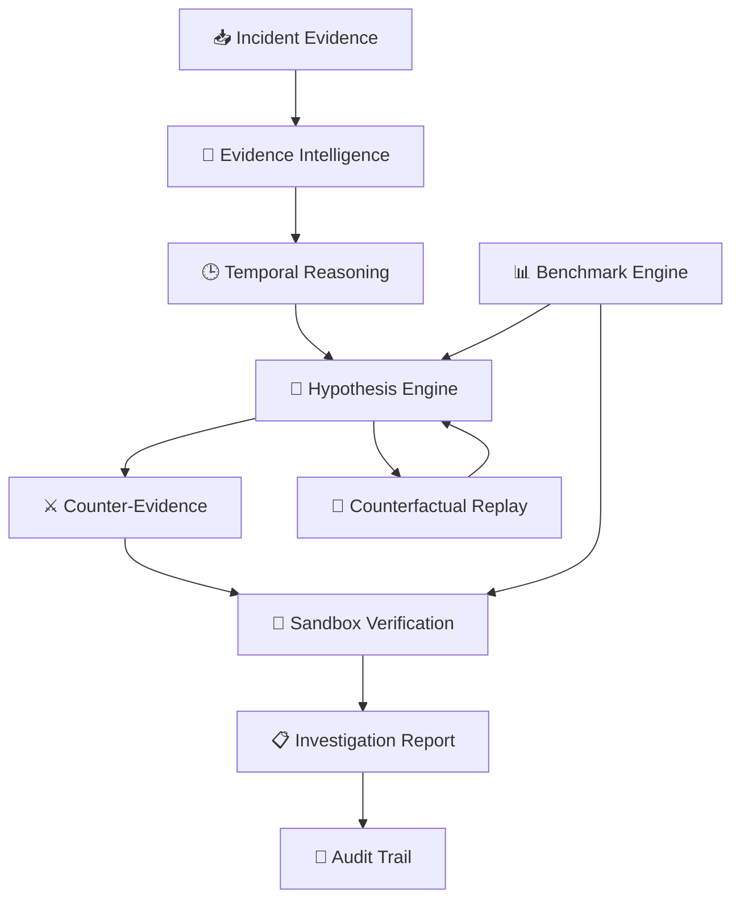

<div align="center">

# 🧠⚡ OpsTwin
### Next-Gen Agentic Incident Intelligence

**AI-powered investigation for complex incidents — evidence first, reasoning visible, verification before conclusion.**

<p>
  
  
  
  
</p>

<p>
  <b>🔎 Observe</b> → <b>🧠 Reason</b> → <b>⚔️ Challenge</b> → <b>🧪 Verify</b> → <b>📋 Explain</b>
</p>

</div>

---

## 🌌 The Idea

**OpsTwin** is a next-generation **agentic incident investigation platform** that turns raw incident evidence into an explainable, verifiable root-cause investigation.

Instead of asking an AI agent to simply **“find the problem”**, OpsTwin creates a structured reasoning loop:

> **Evidence → Timeline → Hypotheses → Counter-Evidence → Verification → Report**

The result is designed to be **explainable, reproducible, auditable and safety-first**.

> 🛡️ **Simulation boundary:** OpsTwin is intended for simulated incidents and evaluation. It does not expose production mutation capabilities.

---

## 🧠 AI Investigation Engine

| Intelligence Layer | Purpose |
|---|---|
| 🔎 **Evidence Intelligence** | Extract and inspect relevant incident signals |
| 🕒 **Temporal Reasoning** | Reconstruct what happened and when |
| 🧠 **Hypothesis Engine** | Generate and rank competing root causes |
| ⚔️ **Adversarial Challenge** | Search for counter-evidence against the leading hypothesis |
| 🧪 **Verification Engine** | Validate reasoning inside a deterministic sandbox |
| 🔁 **Counterfactual Replay** | Explore alternative conditions and outcomes |
| 📊 **Evaluation Engine** | Compare baseline, advanced and adversarial results |
| 🧾 **Audit Engine** | Preserve the complete investigation trajectory |

---

## ⚡ Agentic Workflow

```text
┌─────────────────────────────────────────────────────┐
│              📥 INCIDENT SIGNALS                    │
│       Logs • Events • Metrics • Constraints          │
└─────────────────────────┬───────────────────────────┘
                          ↓
┌─────────────────────────────────────────────────────┐
│ 🔎 OBSERVE                                           │
│ Collect and inspect evidence                         │
└─────────────────────────┬───────────────────────────┘
                          ↓
┌─────────────────────────────────────────────────────┐
│ 🕒 UNDERSTAND                                        │
│ Reconstruct the incident timeline                    │
└─────────────────────────┬───────────────────────────┘
                          ↓
┌─────────────────────────────────────────────────────┐
│ 🧠 REASON                                            │
│ Generate + rank competing hypotheses                │
└─────────────────────────┬───────────────────────────┘
                          ↓
┌─────────────────────────────────────────────────────┐
│ ⚔️ CHALLENGE                                         │
│ Search for counter-evidence                          │
└─────────────────────────┬───────────────────────────┘
                          ↓
┌─────────────────────────────────────────────────────┐
│ 🧪 VERIFY                                             │
│ Test the leading explanation in sandbox              │
└─────────────────────────┬───────────────────────────┘
                          ↓
┌─────────────────────────────────────────────────────┐
│ 📋 EXPLAIN                                            │
│ Produce reproducible diagnosis + audit trail         │
└─────────────────────────────────────────────────────┘
```

---

## 🚀 Why OpsTwin is Different

### Traditional troubleshooting
**Signal → Guess → Fix**

### OpsTwin approach
**Evidence → Timeline → Compete → Challenge → Verify → Explain**

This makes the investigation process more disciplined instead of relying on a single unverified AI answer.

---

## 🖥️ Product Experience

OpsTwin is organized around five investigation experiences:

| Experience | Focus |
|---|---|
| 🖥️ **Command Center** | Incident overview, status and investigation context |
| 🔍 **Investigation Workspace** | Evidence, counter-evidence and hypotheses |
| 📈 **Benchmark Lab** | Reproducible performance evaluation |
| ⚖️ **Baseline vs Advanced** | Measure the impact of agentic reasoning |
| 🧾 **Audit Trail** | Explainable investigation history |

### 🎨 AI-Native Design

The interface follows a futuristic **AI Operations** visual language:

**Deep dark UI · Electric purple · Cyan intelligence signals · Magenta highlights · High-contrast data panels**

---

## 📊 Evaluation Snapshot

| Metric | Result |
|---|---:|
| 🎯 Baseline accuracy | **80%** |
| 🧠 Advanced accuracy | **100%** |
| 📈 Improvement | **+20 percentage points** |
| 🛡️ Adversarial evaluation | **100% — 5/5 passed** |
| 🧪 Fixed incidents | **10** |

> The benchmark measures whether adding structured agentic investigation improves diagnosis quality.

---

## 🏗️ System Architecture



---

## 🧩 Engineering Principles

**🔍 Evidence over assumptions**  
Ground reasoning in observable incident evidence.

**🧠 Multiple hypotheses**  
Do not immediately commit to the first plausible explanation.

**⚔️ Challenge the diagnosis**  
Actively search for evidence that could prove the leading hypothesis wrong.

**🧪 Verify before concluding**  
Use sandbox experiments to test whether the explanation matches observed behavior.

**🧾 Preserve reasoning**  
Keep the investigation trajectory inspectable and reproducible.

**🛡️ Safety first**  
Separate simulated investigation from real production operations.

---

## 🧰 Technology

<p>
  
  
  
  
  
</p>

**Core engineering:** Agentic workflows • Incident analysis • Root-cause reasoning • Evidence ranking • Sandbox verification • Counterfactual replay • Benchmarking • Audit artifacts • Automated testing • CI/CD

---

## 📂 Project Structure

```text
opstwin-agentic-workflows/
│
├── 🤖 agents/                 # Agentic investigation logic
├── 📏 baseline/               # Baseline diagnosis workflow
├── 📊 evaluation/             # Benchmark + adversarial evaluation
├── 🖥️ frontend/               # AI-native web interface
├── 📁 data/incidents/         # Simulated incident scenarios
├── 🛠️ tools/                  # Supporting utilities
├── 🏆 submission/              # Challenge artifacts
├── 🖼️ assets/                 # Project visuals
├── 🧪 tests/                  # Automated tests
├── 📦 requirements.txt
└── 📖 README.md
```

---

## 🚀 Quick Start

### 01 · Clone

```bash
git clone https://github.com/nitindrathod4-alt/opstwin-agentic-workflows.git
cd opstwin-agentic-workflows
```

### 02 · Install

```bash
python -m pip install -r requirements.txt
```

### 03 · Test

```bash
pytest
```

### 04 · Launch

Open:

```text
frontend/index.html
```

---

## 🏆 micro1 Frontier Engineering Challenge 2026

Built for the **micro1 Frontier Engineering Challenge 2026** around a simple idea:

> **AI incident investigation should not stop at prediction. It should reason, challenge, verify and explain.**

---

## 👨‍💻 Builder

<div align="center">

### Nitin Rathod

**DevOps / Cloud Engineer**  
AWS • Linux • Automation • AI Engineering

<a href="https://github.com/nitindrathod4-alt">
  
</a>

<br><br>

**⚡ Build intelligent systems. Investigate deeply. Verify everything.**

</div>

## 🧭 11 — Product Mental Model

OpsTwin treats an incident as an investigation graph rather than a single prompt. Evidence feeds observations, observations feed hypotheses, hypotheses are challenged, and verification feeds the final report.

### Engineering Notes

The important design choice is that intermediate states remain visible. This makes the system easier to reason about, test, and improve.

### OpsTwin Rule

> Evidence is the source of truth; generated reasoning is a proposal until verified.


## 🔎 12 — Evidence Lifecycle

Every investigation starts with available signals. The workflow should identify relevant evidence before selecting a root cause.

### Engineering Notes

Evidence can be grouped by source, time, severity, and relationship to the incident. Grouping reduces noise without hiding the underlying signals.

### OpsTwin Rule

> A useful investigation can explain why a signal was considered important.


## 🕒 13 — Temporal Reasoning

Incident timelines provide the ordering required to distinguish possible causes from later symptoms.

### Engineering Notes

A deployment before an error spike is potentially relevant; an alert generated after the spike is generally a symptom or detection signal.

### OpsTwin Rule

> Temporal relevance should influence investigation priority, not automatically prove causation.


## 🧠 14 — Hypothesis Lifecycle

A hypothesis begins as a candidate explanation and becomes stronger or weaker as evidence arrives.

### Engineering Notes

The lifecycle can be represented as candidate, supported, challenged, verified, rejected, or uncertain.

### OpsTwin Rule

> Keeping state explicit makes the investigation easier to audit.


## ⚔️ 15 — Challenge Loop

The challenge stage deliberately looks for reasons the leading hypothesis may be wrong.

### Engineering Notes

This can expose confirmation bias, misleading telemetry, coincidental timing, and incomplete evidence.

### OpsTwin Rule

> A good investigator actively searches for disconfirming evidence.


## 🧪 16 — Verification Loop

Verification converts a proposed explanation into a testable claim.

### Engineering Notes

The experiment should define an expected outcome before observing the result whenever possible.

### OpsTwin Rule

> Verification should be isolated, repeatable, and safe.


## 📋 17 — Explanation Layer

The final report should summarize the incident without losing the evidence chain.

### Engineering Notes

A concise executive answer can coexist with a detailed technical trail.

### OpsTwin Rule

> Explanation quality depends on evidence traceability, not verbosity alone.


## 🧾 18 — Audit Layer

Audit artifacts preserve what the investigation knew and did at each stage.

### Engineering Notes

This is useful for debugging, evaluation, review, and future system improvements.

### OpsTwin Rule

> Auditability also helps separate facts from generated assumptions.


## 📊 19 — Evaluation Layer

Evaluation compares workflow behavior under controlled incident scenarios.

### Engineering Notes

A benchmark is most useful when inputs remain stable and scoring rules are explicit.

### OpsTwin Rule

> The goal is to measure improvement rather than simply produce impressive demos.


## 🛡️ 20 — Safety Layer

The project keeps investigation and production mutation separate.

### Engineering Notes

Sandbox-first experimentation reduces operational risk and makes tests reproducible.

### OpsTwin Rule

> Future production integrations should add authorization, approval, rollback, and policy enforcement.


## ☁️ 21 — DevOps Alignment

OpsTwin maps naturally to incident response, observability, CI/CD troubleshooting, and SRE workflows.

### Engineering Notes

The platform can become a reasoning layer above logs, events, metrics, and deployment signals.

### OpsTwin Rule

> The current implementation should be understood as a simulation and evaluation project.


## 🤖 22 — Agent Responsibilities

Specialized responsibilities can make an agentic workflow easier to test than one giant prompt.

### Engineering Notes

Evidence, timeline, hypothesis, challenge, verification, report, and audit responsibilities can be evaluated independently.

### OpsTwin Rule

> Modularity also makes future model or tool changes easier.


## 🔁 23 — Feedback Loops

Agentic systems improve when later stages can influence earlier assumptions.

### Engineering Notes

Counter-evidence can lower hypothesis priority; verification can reject a previously strong explanation.

### OpsTwin Rule

> This feedback loop is one of the defining differences between a static answer and an investigation workflow.


## 🧩 24 — Failure Taxonomy

Investigation failures can be classified instead of treated as generic errors.

### Engineering Notes

Examples include missing evidence, incorrect chronology, hypothesis collapse, confirmation bias, failed verification, and unsupported conclusions.

### OpsTwin Rule

> A useful taxonomy makes regression analysis more actionable.


## 📈 25 — Quality Signals

Accuracy is important, but process quality matters too.

### Engineering Notes

Useful signals include evidence coverage, contradiction handling, verification success, audit completeness, and uncertainty reporting.

### OpsTwin Rule

> Future benchmarks can score these dimensions independently.


## 🧪 26 — Testable Predictions

A hypothesis becomes easier to verify when it produces a concrete prediction.

### Engineering Notes

For example, a configuration hypothesis may predict that a specific behavior reappears when the configuration is reproduced in a sandbox.

### OpsTwin Rule

> Testable predictions make reasoning operational rather than purely linguistic.


## ⚖️ 27 — Evidence Weighting

Not every signal deserves equal weight.

### Engineering Notes

Direct, temporally relevant, reproducible evidence is generally more useful than weak correlation or unrelated telemetry.

### OpsTwin Rule

> Evidence weighting should remain transparent enough for reviewers to understand.


## 🔍 28 — Counterfactual Questions

Counterfactual questions help distinguish causal explanations from coincidence.

### Engineering Notes

Ask what should happen if the suspected cause is removed, changed, or isolated.

### OpsTwin Rule

> Counterfactual reasoning is strongest when supported by controlled experiments.


## 📚 29 — Knowledge Boundaries

A reliable system should distinguish known facts, inferred relationships, and unresolved uncertainty.

### Engineering Notes

The report should not present an inference as a directly observed fact.

### OpsTwin Rule

> Clear boundaries reduce overclaiming and make human review more effective.


## 🚨 30 — Incident States

An investigation can move through states such as new, collecting, reasoning, challenged, verifying, resolved, or uncertain.

### Engineering Notes

Explicit states improve UI clarity and make workflow execution easier to inspect.

### OpsTwin Rule

> A state machine can also help prevent unsafe transitions.


## 🖥️ 31 — Command Center UX

The command center should answer three questions quickly: what is happening, what is suspected, and what has been verified.

### Engineering Notes

High-value information should appear before deep technical details.

### OpsTwin Rule

> Status, confidence, evidence, and safety state should remain visually distinct.


## 🔬 32 — Investigation Workspace UX

The workspace should let engineers move between evidence, hypotheses, counter-evidence, and experiments.

### Engineering Notes

A split view can connect each conclusion to its supporting artifacts.

### OpsTwin Rule

> The interface should reduce context switching during investigation.


## 📊 33 — Benchmark UX

Benchmark views should make baseline and advanced workflows directly comparable.

### Engineering Notes

Show totals, accuracy, failures, adversarial outcomes, and notable regressions.

### OpsTwin Rule

> A benchmark dashboard should emphasize reproducibility over decorative metrics.


## 🧾 34 — Audit UX

Audit views should make the investigation sequence understandable to a reviewer.

### Engineering Notes

Each step can expose the input, action, output, and resulting state.

### OpsTwin Rule

> The goal is not to reveal hidden chain-of-thought; it is to expose useful, stored investigation artifacts.


## 🛠️ 35 — Engineering Workflow

Development should follow a small-change, test, evaluate, review, document cycle.

### Engineering Notes

This reduces the chance that a local improvement silently breaks another incident scenario.

### OpsTwin Rule

> Documentation is part of engineering quality.


## 🔄 36 — CI/CD Strategy

Continuous integration can run tests and evaluation whenever relevant code changes.

### Engineering Notes

A mature pipeline can publish benchmark artifacts and flag regressions.

### OpsTwin Rule

> The exact CI policy should evolve with repository requirements.


## 📦 37 — Release Discipline

A release should identify code changes, benchmark changes, and documentation changes.

### Engineering Notes

Keeping these records together makes project evolution easier to understand.

### OpsTwin Rule

> Versioned evaluation artifacts are especially valuable for AI systems.


## 🔐 38 — Configuration Safety

Configuration should be externalized where it contains secrets or environment-specific values.

### Engineering Notes

Repository examples should use placeholders rather than real credentials.

### OpsTwin Rule

> Secret scanning and least-privilege CI permissions are recommended for future growth.


## 🌐 39 — Integration Model

Future integrations can normalize signals from different operational systems into a common evidence format.

### Engineering Notes

Adapters isolate external APIs from the investigation engine.

### OpsTwin Rule

> This makes the core reasoning workflow less dependent on any single telemetry provider.


## ☸️ 40 — Kubernetes Scenario Model

A future scenario adapter could represent pods, deployments, services, events, resource limits, and application logs.

### Engineering Notes

The investigation engine would consume normalized simulated signals rather than directly mutating a cluster.

### OpsTwin Rule

> This preserves the simulation-first safety model.


## ☁️ 41 — Cloud Scenario Model

Cloud scenarios can represent compute, networking, load balancing, storage, databases, and observability signals.

### Engineering Notes

A simulated cloud incident can be evaluated without granting destructive cloud permissions.

### OpsTwin Rule

> Production integration should be treated as a separate security project.


## 🚀 42 — Deployment Scenarios

Deployment regressions are useful benchmark cases because they combine chronology, configuration, and application behavior.

### Engineering Notes

The workflow can compare pre-deployment and post-deployment signals.

### OpsTwin Rule

> Verification can reproduce the suspected change in an isolated environment.


## 🗄️ 43 — Database Scenarios

Database incidents may involve latency, connection exhaustion, schema changes, or resource constraints.

### Engineering Notes

Multiple signals can produce similar symptoms, making hypothesis competition valuable.

### OpsTwin Rule

> A good scenario should contain both supporting and misleading evidence.


## 🌐 44 — Network Scenarios

Network failures can produce application symptoms that look like application defects.

### Engineering Notes

Timeline and dependency evidence help separate transport problems from application-level problems.

### OpsTwin Rule

> Counter-evidence is especially important when several systems fail at once.


## 📉 45 — Resource Scenarios

Resource exhaustion can create cascading symptoms.

### Engineering Notes

CPU, memory, disk, connection pools, and queue depth can all become candidate evidence.

### OpsTwin Rule

> Verification should reproduce the resource condition without affecting real workloads.


## 🔁 46 — Change Correlation

Recent changes are useful clues but should not automatically be treated as root causes.

### Engineering Notes

A change is stronger evidence when its timing, mechanism, and reproducibility align with the incident.

### OpsTwin Rule

> OpsTwin's challenge stage is designed to test this distinction.


## 🧠 47 — Model-Agnostic Design

The investigation workflow can be separated from a particular language model.

### Engineering Notes

This makes it possible to compare models, prompts, tools, or deterministic components using the same benchmark.

### OpsTwin Rule

> Evaluation should focus on observable workflow outcomes.


## 📐 48 — Determinism

Deterministic components are valuable for benchmark reproducibility.

### Engineering Notes

Fixed incident inputs and stable verification environments make regression detection easier.

### OpsTwin Rule

> Where nondeterminism exists, evaluation should use appropriate repeated trials or tolerances.


## 🧪 49 — Experiment Design

A verification experiment should specify inputs, expected behavior, observed behavior, and interpretation.

### Engineering Notes

Changing many variables simultaneously weakens causal conclusions.

### OpsTwin Rule

> Small controlled experiments are easier to audit and reproduce.


## ⚠️ 50 — Uncertainty Handling

Uncertainty is a valid outcome.

### Engineering Notes

When evidence is incomplete or contradictory, the system should communicate that limitation instead of forcing a definitive root cause.

### OpsTwin Rule

> A trustworthy investigator knows when not to overclaim.


## 👤 51 — Human Review Gates

Human checkpoints are useful when uncertainty or operational impact is high.

### Engineering Notes

Reviewers should see the evidence and verification result needed to make a decision.

### OpsTwin Rule

> Future automation should never silently bypass configured approval policies.


## 🔒 52 — Access Control Direction

Future platform versions may require roles for investigators, reviewers, and administrators.

### Engineering Notes

Permissions should follow least privilege.

### OpsTwin Rule

> Audit events should record relevant authorization decisions without exposing secrets.


## 📜 53 — Governance Direction

As agentic systems become more capable, governance should cover model behavior, tools, data, permissions, and outputs.

### Engineering Notes

Policy checks can prevent unsupported or unsafe actions.

### OpsTwin Rule

> Governance should be measurable and testable.


## 🧠 54 — Memory Direction

Future investigation memory could store reusable incident patterns and verified experiments.

### Engineering Notes

Memory should be scoped, reviewable, and privacy-aware.

### OpsTwin Rule

> A remembered pattern should be treated as a clue, not unquestionable truth.


## 🔎 55 — Retrieval Direction

A future retrieval layer could locate similar historical incidents or known failure signatures.

### Engineering Notes