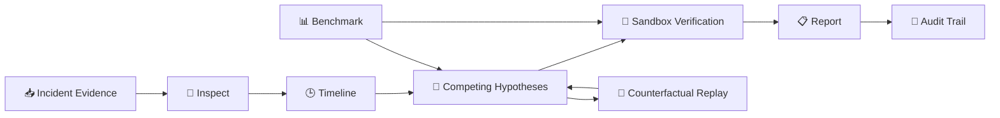

# 🧠 OpsTwin — Agentic Incident Investigation Platform

<p align="center"><strong>Evidence-driven incident diagnosis with an auditable reasoning trail.</strong></p>

<p align="center">


</p>

> **OpsTwin** is an agentic incident investigation platform for simulated production incidents. It analyzes evidence, ranks competing root-cause hypotheses, verifies conclusions in a sandbox, supports counterfactual replay, and preserves an auditable investigation trail.

<p align="center"><b>🔎 Inspect → 🕒 Timeline → ⚔️ Compete → 🧪 Verify → 📋 Report</b></p>

---

## 🖥️ Product UI

<p align="center">
  
</p>

The actual frontend in `frontend/index.html` is a dark, responsive **Incident Command Center**. It contains a persistent navigation rail and four main views: **Overview, Investigation, Benchmark, and Audit**.

### 🔥 Live Incident Analyzer

The Overview page includes a live analyzer for an incident, alert, error, or log summary. It displays:

- Diagnosis
- Heuristic confidence
- Ranked competing hypotheses
- Supporting / counter-evidence indicators
- Simulation-only status

### 📊 Overview Dashboard

The dashboard includes:

| UI Area | What it shows |
|---|---|
| Advanced accuracy | **100%** |
| Baseline accuracy | **80%** |
| Adversarial | **100% / 5 of 5 passed** |
| Safety posture | **Sandbox / protected execution** |
| Incident timeline | Incident signal → corroborating evidence → sandbox verification |
| Competing hypotheses | Ranked root-cause candidates with scores |
| Verification & controls | Sandbox, evidence recording, production mutation, human checkpoint |
| Reproducible report | Generated investigation artifact |

### 🔍 Investigation View

The Investigation view contains:

- **Evidence Explorer** — All / Supporting / Counter-evidence filters
- **Counterfactual Replay** — remove deployment, log, or metrics evidence and rerun the replay
- **Investigation workflow** — Inspect → Timeline → Compete → Verify → Report

### 📈 Benchmark View

The Benchmark view evaluates the workflow against **10 fixed incidents** and compares baseline and advanced diagnoses.

### 🧾 Audit View

The Audit view records the investigation trail, including evidence inspection, timeline, competing hypotheses, counter-evidence, sandbox verification, human checkpoint, and baseline/advanced diagnosis.

---

## 🎯 Why OpsTwin?

OpsTwin follows an **evidence-first** investigation model:

- 🔎 Inspect incident evidence and constraints
- 🕒 Reconstruct events into a timeline
- ⚔️ Compare competing root-cause hypotheses
- 🧪 Verify conclusions using sandbox experiments
- 🔁 Test diagnosis with counterfactual replay
- 📋 Generate a reproducible report
- 🧾 Preserve an auditable investigation trail

**Safety by design:** the frontend explicitly labels the environment **SAFE / SIMULATION ONLY** and states that no production mutations are exposed.

---

## 🏗️ Architecture



---

## 📈 Benchmark Snapshot

| Metric | Result |
|---|---:|
| 🧪 Baseline accuracy | **80%** |
| 🚀 Advanced accuracy | **100%** |
| 📈 Improvement | **+20 percentage points** |
| 🛡️ Adversarial | **100% — 5/5 passed** |
| 📦 Fixed incidents | **10** |

---

## 🧰 Tech & Engineering

- 🐍 Python
- 🌐 HTML5 / CSS3 / JavaScript
- 🤖 Agentic investigation workflow
- 🔎 Evidence analysis
- 🧠 Root-cause hypothesis ranking
- 🧪 Deterministic sandbox verification
- 🔁 Counterfactual replay
- 📊 Benchmark & adversarial evaluation
- 🧾 Audit / trajectory artifacts
- ✅ Automated tests
- ⚙️ GitHub Actions CI

---

## 📂 Project Structure

```text
opstwin-agentic-workflows/
├── 🤖 agents/                 # Investigation agents and orchestration
├── 📏 baseline/              # Baseline workflow
├── 📊 evaluation/            # Benchmark and adversarial evaluation
├── 🖥️ frontend/
│   └── index.html            # Actual Incident Command Center UI
├── 📁 data/incidents/        # Synthetic incident cases
├── 🛠️ tools/                # Evidence, timeline, replay and sandbox tools
├── 🏆 submission/            # Hackathon results and trajectories
├── 🖼️ assets/
│   └── opstwin-5-panels.jpg  # UI showcase
├── 🧪 tests/                 # Automated tests
├── 📦 requirements.txt
└── 📖 README.md
```

---

## 🚀 Quick Start

```bash
git clone https://github.com/nitindrathod4-alt/opstwin-agentic-workflows.git
cd opstwin-agentic-workflows
python -m pip install -r requirements.txt
pytest
```

### Web application

The main frontend is:

```text
frontend/index.html
```

The UI calls backend endpoints for incidents, cases, and counterfactual replay.

---

## 🧪 Evaluation & Reproducibility

The repository includes:

- Baseline vs advanced evaluation
- Fixed incident benchmark
- Adversarial cases
- Counterfactual replay
- Investigation trajectories
- Automated tests
- CI workflow

---

## 🔐 Safety & Auditability

OpsTwin is intentionally designed as a **simulation environment**:

- 🚫 No production mutations
- 🧪 Sandbox verification
- 🧾 Evidence and decisions recorded
- 🔁 Reproducible investigation flow
- 👤 Human checkpoint required
- ⚠️ Counter-evidence explicitly preserved

---

## 🏆 micro1 Frontier Engineering Challenge 2026

Built for the **micro1 Frontier Engineering Challenge 2026**.

The project demonstrates an evidence-driven, auditable approach to agentic incident investigation with benchmark, adversarial, and counterfactual evaluation.

---

## 💡 Key Learning

> Building reliable agentic systems is not only about generating a diagnosis — it is about **evidence, competing hypotheses, verification, reproducibility, safety, and auditability**.

---

## 👨‍💻 Author

**Nitin Rathod**

<p align="center"><strong>🚀 Build. Investigate. Verify. Learn.</strong></p>
